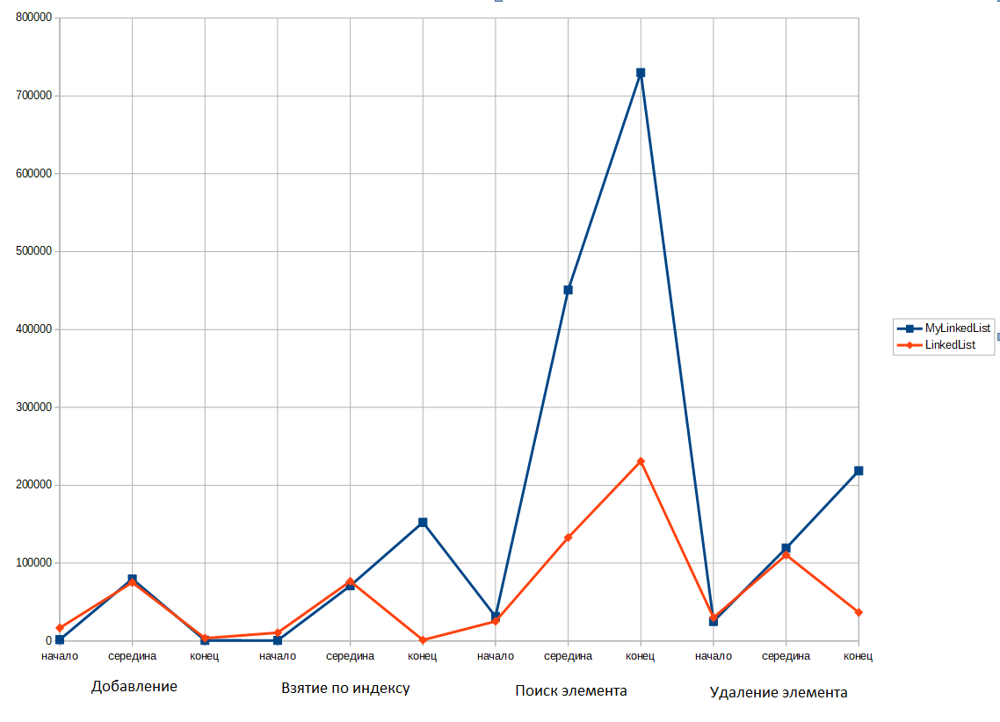
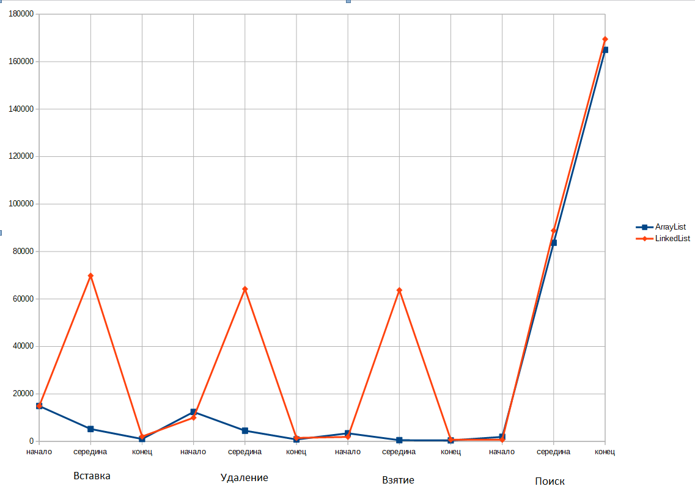
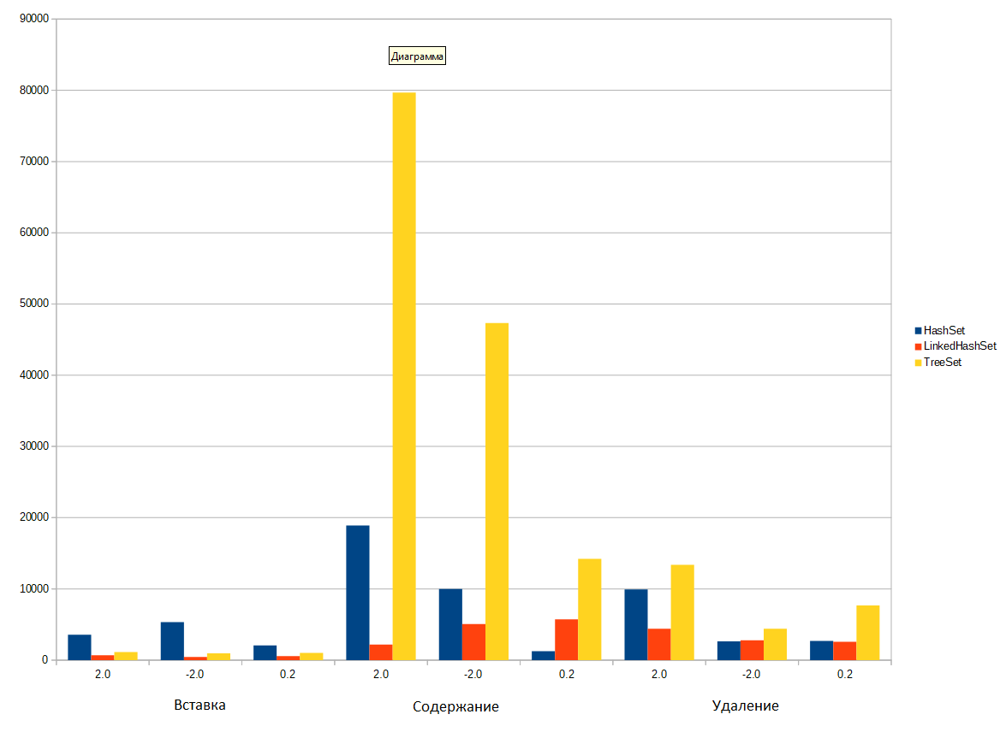
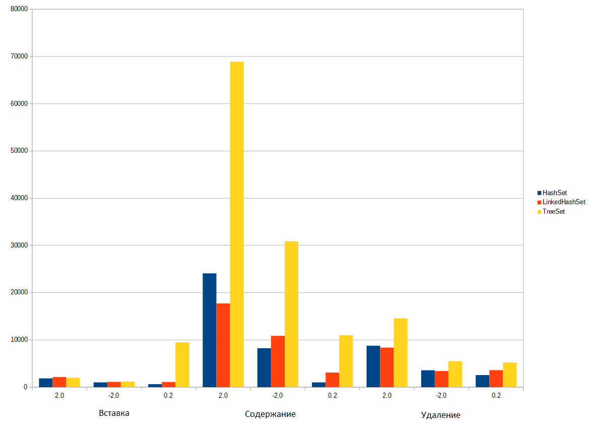
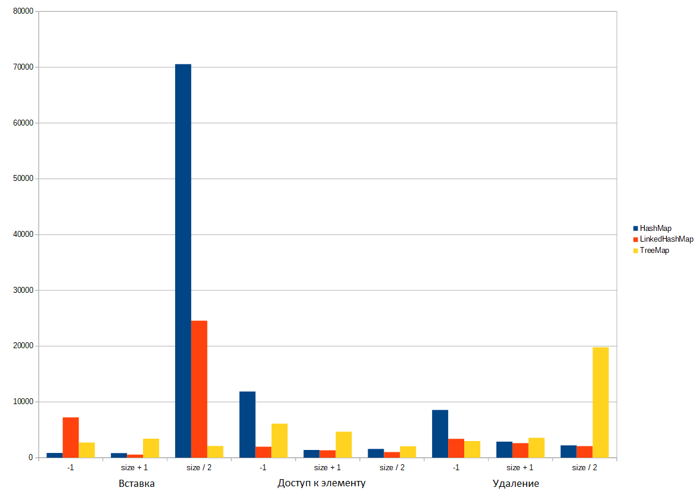
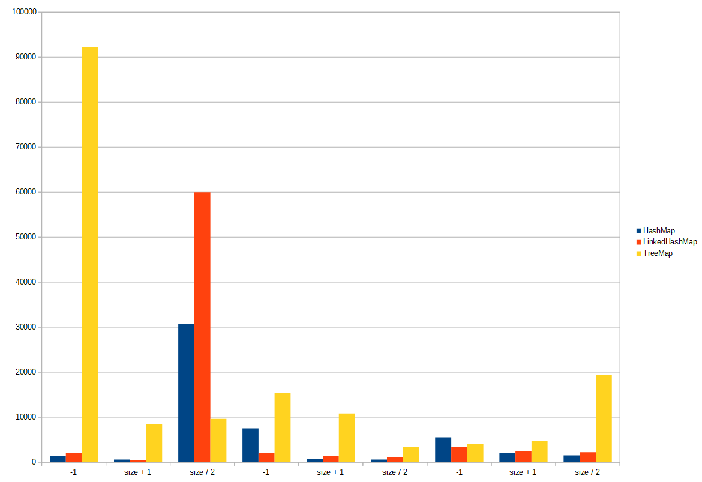

# java_task3_collections
### _сравнение MyLinkedList и LinkedList из java.util_
Для тестирования MyLinkedList и LinkedList заполнялись одинаковыми рандомными целыми числами.
Всего использовалось 10000 узлов.
Было сделано 5 прогонов и в таблице указано среднее значение использованного времени для различных операций (в наносекундах).

|  |  | MyLinkedList | LinkedList |
| - | - | ------------ | ---------- |
| Добавление | в начало | 1700 | 16760 |
|  | в серидину | 79680 | 75140 |
|  | в конец  | 800 | 3580 |
| Взятие элемента по индексу | в начале | 700 | 10620 |
|  | в серидине | 70940 | 76700 |
|  | в конце | 152360 | 1260 |
| Поиск индекса элемента | в начале | 31420 | 25220 |
|  | в серидине | 450800 | 132880 |
|  | в конце | 729940 | 230860 |
| Удаление элемента | в начале | 25180 | 30040 |
|  | в серидине | 119220 | 110480 |
|  | в конце | 218640 | 36720 |

Для наглядности сравнение поизводительности списков на графике:

Как мы видим изходя из таблицы и графика можем сказать, что преимущество моей реализации перед стандартной является только вставка и доступ к эдементом в начале списка. По всем остальным операциям стандартная реализация превосходит в скорости исполнения мою, особенно это наблюдается во время поиска элемента в списке.

## Сравнение структур данных из Java Collections Framework
Для этого был написан класс TestCollections.java где в методе main вызываются методы для вычисления производительности различных коллекций
### _Сравнение ArrayList и LinkedList_
Была взята выборка рандомных чисел в колличестве 10000 штук для каждого листа.
Было сделано 5 прогонов и ниже в таблице указано среднее выполение каждой операции в наносекундах.

|  |  | ArrayList | LinkedList |
| - | - | --------- | ---------- |
| Вставка | в начало | 13760 | 14900 |
|  | в середину | 4979 | 69819 |
|  | в конец | 480 | 2040 |
| Удаление | в начале | 12200 | 9980 |
|  | в середине | 3959 | 64220 |
|  | в конце | 840 | 1460 |
| Взятие элемента | в начале | 3579 | 1879 |
|  | в середине | 539 | 63720 |
|  | в конце | 420 | 700 |
| Поиск элемента | в начале | 2140 | 660 |
|  | в середине | 94200 | 88820 |
|  | в конце | 170459 | 169500 |

Для наглядности сравнение поизводительности списков на графике:

Как мы видим все операции производимые с ArrayList в основном быстрее, чем с LinkedList, особенно когда в операции необходимо что-то сделать в середине списка. Только при увеличении размеров списков, например до 100000 или даже до 1000000,
тогда скорость добавления и удаления из начала списка у LinkedList начинает превосходить скорость этих же операций у ArrayList. Что говорит о том, что если у нас много изменяемых данных, количество которых постоянно пеняется, то вероятно лучше будет использовать LinkedList, но если у нас много данных, колличество которых за частую не меняется, то лучше будет использовать ArrayList

### _Сравнение HashSet, LinkedHashSet и TreeSet_
Была взята выборка рандомных чисел в колличестве 10000, а также 1000000 штук для каждого set'а (вещественные числа от 0 до 1.0).
Было сделано 5 прогонов и ниже в таблице указано среднее выполение каждой операции в наносекундах.

Для 10000

|  | Число над которым проводи операцию | HashSet | LinkedHashSet | TreeSet |
| - | - | --------- | ---------- | ------- |
| Вставка | 2.0 | 3560 | 680 | 1140 |
|  | -2.0 | 5320 | 440 | 940 |
|  | 0.2 | 2059 | 560 | 999 |
| Проверка на содержание | 2.0 | 18899 | 2180 | 79680 |
|  | -2.0 | 9980 | 5060 | 47319 |
|  | 0.2 | 1239 | 5720 | 14219 |
| Удаление | 2.0 | 9919 | 4420 | 13380 |
|  | -2.0 | 2639 | 2780 | 4419 |
|  | 0.2 | 2699 | 2560 | 7680 |

Для наглядности сравнение поизводительности set'ов на графике:

Для 1000000

|  | Число над которым проводи операцию | HashSet | LinkedHashSet | TreeSet |
| - | - | --------- | ---------- | ------- |
| Вставка | 2.0 | 1860 | 2119 | 1999 |
|  | -2.0 | 1019 | 1100 | 1179 |
|  | 0.2 | 640 | 1079 | 9500 |
| Проверка на содержание | 2.0 | 24080 | 17700 | 68879 |
|  | -2.0 | 8240 | 10859 | 30860 |
|  | 0.2 | 1019 | 3100 | 11020 |
| Удаление | 2.0 | 8780 | 8360 | 14580 |
|  | -2.0 | 3560 | 3400 | 5480 |
|  | 0.2 | 2560 | 3600 | 5220 |

Для наглядности сравнение поизводительности set'ов на графике:

Изходя из таблиц и графиков можем сделать вывод, что производительность операций для HashSet и LinkedHashSet практически идентичная, но заметно преимущество LinkedHashSet по поиску на содержание при меньшем колличестве данных. Производительность TreeSet при увеличении количества данных возрасла, можно предположить, что на намного больших объёмов данных её скорость работы может превзойти Hashset и LinkedHashSet (производительность по поиску, остальные операции при 1000000 стали сравнимы со скоростью этих же операций в HashSet и LinkedHashSet).

### _Сравнение HashMap, LinkedHashMap и TreeMap_
Была взята выборка рандомных чисел в колличестве 10000, а также 1000000 штук для каждого map'а (вещественные числа от 0 до 1.0) (а ключи от 0 до size, где size = количеству чисел в выбоке).
Было сделано 5 прогонов и ниже в таблице указано среднее выполение каждой операции в наносекундах.
Для 10000

|  | Ключ операции | HashMap | LinkedHashMap | TreeMap |
| - | - | --------- | ---------- | ------- |
| Вставка | -1 | 839 | 7220 | 2700 |
|  | size + 1 | 820 | 560 | 3400 |
|  | size / 2 | 70560 | 24559 | 2100 |
| Доступ к элементу | -1 | 1960 | 2180 | 6099 |
|  | size + 1 | 1380 | 1319 | 4660 |
|  | size / 2 | 1560 | 1019 | 2039 |
| Удаление | -1 | 8560 | 3380 | 2980 |
|  | size + 1 | 2880 | 2600 | 3579 |
|  | size / 2 | 2199 | 2080 | 19779 |

Для наглядности сравнение поизводительности map'ов на графике:

Для 1000000

|  | Ключ операции | HashMap | LinkedHashMap | TreeMap |
| - | - | --------- | ---------- | ------- |
| Вставка | -1 | 1319 | 1980 | 92280 |
|  | size + 1 | 580 | 400 | 8500 |
|  | size / 2 | 30720 | 60000 | 9639 |
| Доступ к элементу | -1 | 7540 | 2020 | 15360 |
|  | size + 1 | 799 | 1340 | 10839 |
|  | size / 2 | 580 | 1059 | 3379 |
| Удаление | -1 | 5519 | 3440 | 4100 |
|  | size + 1 | 2019 | 2420 | 4660 |
|  | size / 2 | 1539 | 2220 | 19360 |

Для наглядности сравнение поизводительности map'ов на графике:

Исходя из приведённых таблиц и графиков, можно сказать, что эффективность работы операций для HashMap, LinkedHashMap и TreeHashMap (при целочисленных ключах), практически идентична на различном колличестве элементов. Медленнее всего обычно выполняется вставка для HashMap и LinkedHashMap.
